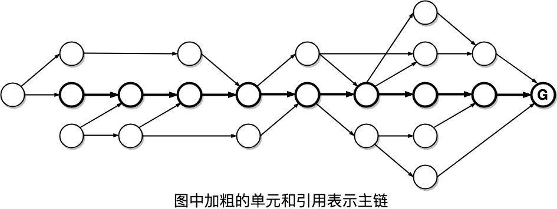
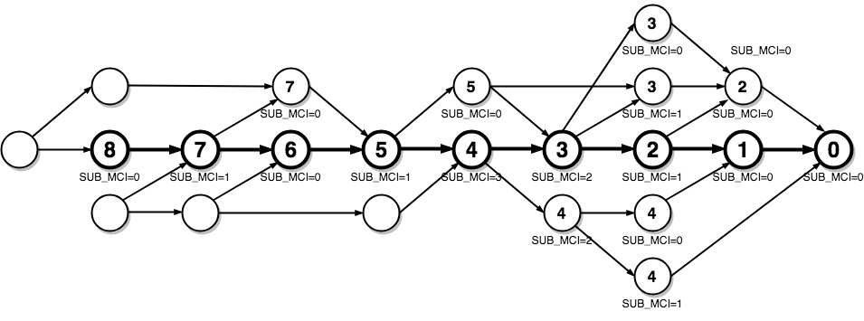
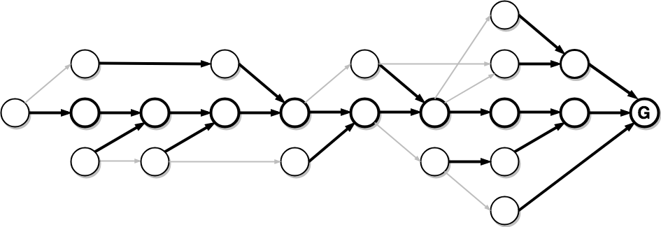

# SDAG共识

## 概述
SDAG网络中每个节点都维护着自己本地的图，图中包含了该节点所收到的所有的单元信息以及这些单元之间的引用关系，根据图中的信息，节点可以得出这个图中所有单元即所有交易的全局顺序，进而可以验证这些交易的有效性。例如存在两个双花的交易，那就只需要比较两个交易的全局顺序，顺序靠前那笔交易被确认为有效，之后的那笔交易无效。因而SDAG共识的目标就是在SDAG网络中所有节点中，关于所有单元的全局顺序达成一个确定的共识。

## 主链
有向无环图含有分支，因此对于不同的分支上的单元无法直接比较顺序，在此假设图中存在一条主链，从它的顶点单元可以沿着主链一直回溯到创世单元，如下图所示。



图中所有的单元可以分为
1. 在主链上；
2. 不在主链上但被主链单元包含；
3. 其它；

- 对于第1种情况的单元，从创世单元开始一直到顶点单元是可以根据引用的拓扑关系直接得出顺序。这个顺序可以用**MCI（主链序）**来表示，创世单元的**MCI**为0，主链上之后的单元一直到顶点单元**MCI**依次递增；
- 对于第2种情况的单元**U**，如果

    1. 某个主链单元**MCU**包含此单元；并且
    2. **MCU**之前的主链单元不包含此单元；

  该单元**U**的MCI设置为该**MCU**的**MCI**;

由此图中所有单元可以根据**MCI**的顺序分成若干组，对于**MCI**不同的单元就可以根据**MCI**的大小排列出顺序，而对于**MCI**相同的单元:

1. Level较小，即在图上先发生的单元胜出；
2. 如Level相等，则单元哈希值较小的单元胜出；

  这个顺序由**SUB_MCI**表示，相同**MCI**中的单元中，主链单元具有最大的**SUB_MCI**

- 对于第3种情况的单元，暂时无法对其在图中的全局顺序有确定的结果。但是随着新单元进入图中，主链也会增长，这些单元也会逐渐变成第1种或者第2种单元。

上图中的关于这三类单元以及具体的**MCI**和**SUB_MCI**最终结果如下图所示。



## 主链推进
主链的引入使得在有向无环图中可以得到全局时序，它的推进算法则直接决定了每个节点的本地图中的全局时序。因此主链在每个节点都应该保持一致，从而保证SDAG全网中所有节点最终对于所有单元的时序达成共识。

### 稳定主链
根据之前对最优父单元的定义，从图中所有顶点沿着各自的最优父节点路径回溯，在经过某个单元**S**以后，这些路径会完全重合，也就是说这些路径都收敛于这个单元，那么从**S**到创世单元这一条路径，可以作为**主链**，因为它是稳定的，也称为**稳定主链**。单元**S**也叫**全局稳定点**。
- 显然，稳定主链的起点是创世单元，创世单元天然是稳定的，也就是说传世单元是最初的全局稳定点。
- S是全局稳定点，它的**MCI**也就叫**最终稳定MCI**，随着图形的增长，S会不断向前推进。

### 稳定单元
在由主链的稳定点以及它包含的所有单元所组成了一个子图，子图中的所有单元都是可以基于这个主链排出全局时序的，此时这个子图中所有的节点都是稳定的。

根据单元**MCI**以及**最终稳定MCI**的定义，整个图中所有的稳定单元满足：**MCI**<=**最终稳定MCI**

### 稳定的条件

#### 最优子单元
最优子单元是指那些选择自己作为最优父单元的孩子单元，可能不存在，也可能有多个。从一个单元出发，沿着孩子方向，最优子单元会形成一颗树，如下图所示。



#### 相对稳定

取主链稳定点S的最优子单元树中被一个后续单元U包含的子集，考虑以下两种情况：

1. 最优子单元树的根只有一个分支B1, U自然是这个分支的叶子节点

    - 在B1上，由U出发向根的方向回溯，收集到多数公证人集合W的公证单元后，记录该单元U，

    - 鉴于公证人发的公证单元必须包含自己之前发的公证单元，集合W中的公证人再发的所有公证单元的WL的最小值就是单元U的WL，称为这个分支的MIN_WL

    - 即便未来有新的分支B2，即使得到剩下全部公证人的支持，B2上所有单元中最大的WL都小于S.Level

    - 此时如果当前仅有分支的MIN_WL > S.Level，假设未来有单元包含了B1和B2，最优父单元还是会指向B1，也就意味新单元的最优父单元路径肯定会经过B1的下一个子单元

2. 还有其它备选分支

    - 依旧由U出发回溯，并在此分支B1上计算出MIN_WL

    - 考虑其它备选分支的所有单元集合为C，在这个集合里任意单元即使得到剩下全部公证人的支持，可能产生的最大的WL就是C中所有WL增加单元的Level的最大值，称为**MAX_ALT_LEVEL**

    - 跟第一种情况类似，此时如果B1的MIN_WL > MAX_ALT_LEVEL，新单元的最优父单元路径肯定会经过B1，主链稳定点就可以先前推进到B1的下一个子单元

也就是说，当一条路径得到足够的公证人的支持时，主链稳定点只能沿着这条路径向前推进，其他的可能路径都别确定性的排除掉了。

由此得到判断单元稳定步骤：
1. 计算U所在分支的MIN_WL，即U.MIN_WL

2. 计算S的MAX_ALT_LEVEL

    a. 若没有备选分支 
    ```
    MAX_ALT_LEVEL = S.level
    ```

    b. 若有备选分支
    ```
    MAX_ALT_LEVEL = max { C.level | C.WL_increased }
    ```
    这个过程中，计算C这个集合，可以用对向搜索的算法。

3. 如果`U.MIN_WL > S.MAX_ALT_LEVEL`，则S相对于U是稳定的。


### 主链稳定点推进

主链稳定点的推进就是重复的判定当前主链稳定点的下一个最优子单元是否相对于最新单元稳定，该子单元必须处于沿着最优父单元回溯的路径上，如果成立则表示主链的稳定点可以推进到这个最优子单元。我们注意到只有那些MIN_WL增加了的单元才能有效推进主链，而普通单元对推进主链没有帮助。也就是说只有公证人单元才会促进主链的不断延伸。

在全网的各个节点当中，每个节点本地的图是不完全一样的，因此主链的稳定点也在不同的位置，但是从长远来看这是一个最终一致的情况。

## BALL
在有向无环图中，所有历史信息的不可篡改是由引用所有父单元的哈希来保证的，但是这部分只包含了图中基本拓扑关系的共识，而没有包含我们在图中附加的用于确认全局时序的主链及其相关信息，也就是单元的属性信息。

因此，在单元稳定也就是单元在图中的最终时序确认以后，将这些信息整合于**BALL**中。**BALL**是一个哈希值，类似于默克尔树的根，包括所有父单元引用，MCI，单元最终状态等与主链和最终全局时序相关的信息，如果这些属性不同，生成**BALL**的值也会不同。

于是生成单元时，在每个单元里加入LAST_BALL_UNIT和LAST_BALL，分别表示此时主链的稳定点和该稳定点的**BALL**，也就是在这个单元的视角下，它能看到的所有历史中可确定的全局时序的浓缩。

相应的，在验证一个单元U时，必须验证该单元中的LAST_BALL跟本节点对LAST_BALL_UNIT的**BALL**值一致，这样才能保证所有节点之间对于已经确定时序的历史的共识。而计算LAST_BALL_UNIT的**BALL**值，就需要LAST_BALL_UNIT相对于该单元的最优父单元相对稳定，也就是说从该单元的最优父单元能看到的历史子图中能推导出LAST_BALL_UNIT是主链单元，进而才能对比验证。这个约束条件进一步限制了攻击者随意发送单元的可能性。


## 结论

主链的推进也就是全局稳定点的推进。整个共识算法只涉及到图的算法，没有传统PoW的无用计算，共识算法可以非常快。


